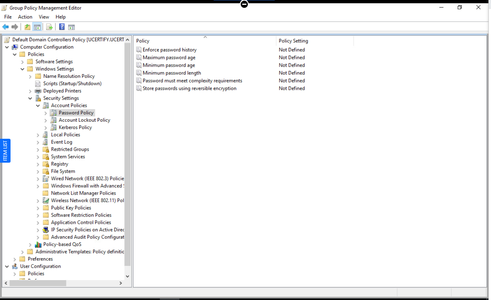
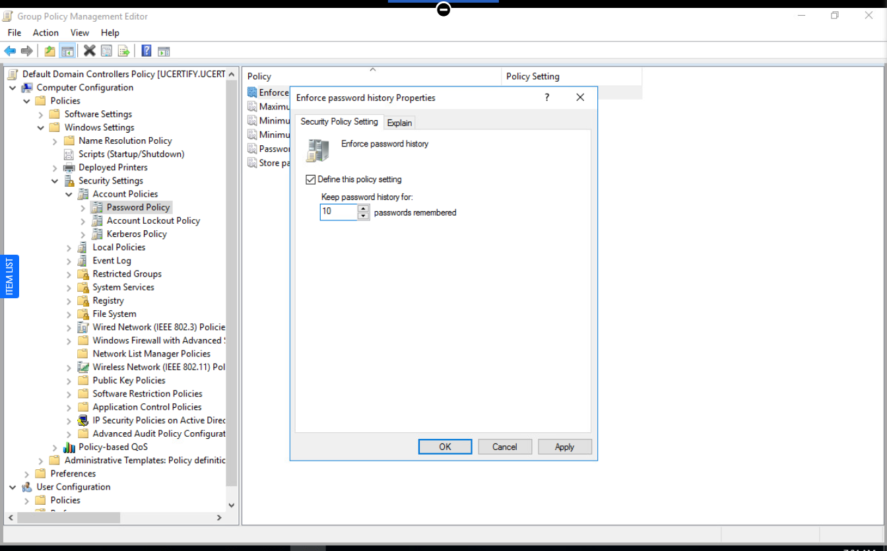
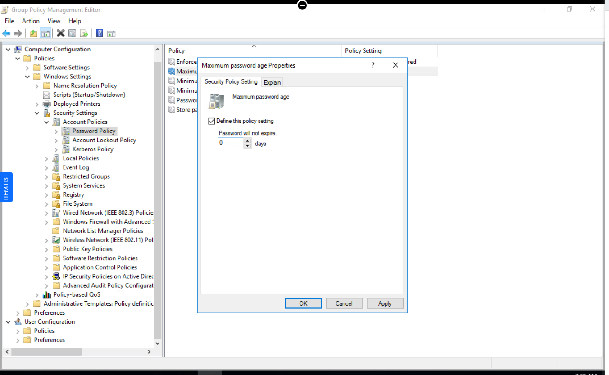
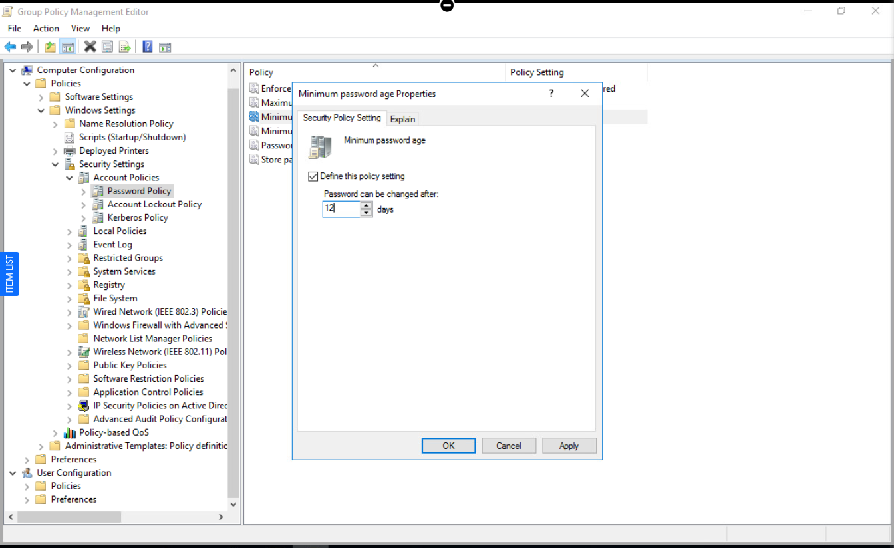
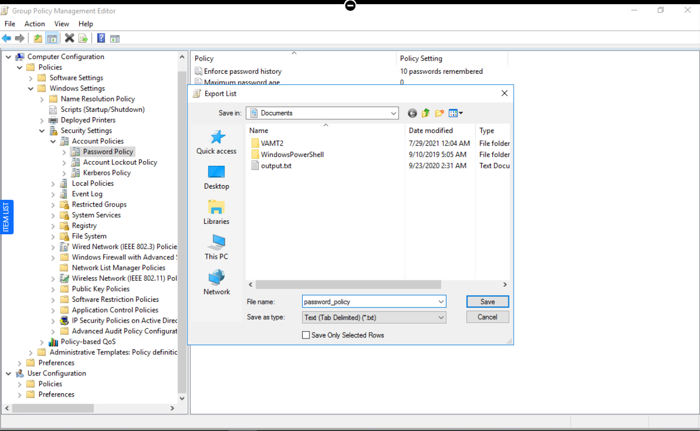

# 🛡️ Active Directory Password Policy Lab

> Security+ / CySA+ Project: This lab configures an Active Directory password policy using Group Policy Management, focusing on password history, maximum age, and minimum age.

---

## 📌 Overview

This lab demonstrates how to configure an **AD domain password policy** via the **Group Policy Management Editor**.  
You adjust password history, maximum password age, and minimum password age to meet a new organization policy.

---

## 🎯 Objectives

- View existing password policy settings in Group Policy.  
- Configure **Enforce password history** to prevent password reuse.  
- Configure **Maximum password age** to disable forced password expiration.  
- Configure **Minimum password age** to control how frequently users can change passwords.  
- Export the password policy settings for documentation.

---

## 🧪 Lab Steps

### 1. Open Password Policy in GPMC

1. Open **Group Policy Management** on the domain controller.
2. Edit the appropriate GPO (for example, `Default Domain Policy`).
3. Navigate to:  
   `Computer Configuration → Policies → Windows Settings → Security Settings → Account Policies → Password Policy`.

---

### 2. Configure Enforce password history

1. In the right pane, double-click **Enforce password history**.
2. Check **Define this policy setting**.
3. Set the value to **10** passwords remembered.
4. Click **OK**.

Effect: The system remembers the last 10 passwords for each user, preventing immediate reuse.

---

### 3. Configure Maximum password age

1. Double-click **Maximum password age**.
2. Check **Define this policy setting**.
3. Set **Password will expire in** to **0** days.
4. Click **OK** (accept any suggested value warnings).

Effect: Passwords never expire, matching the new requirement that regular password changes are no longer required.

---

### 4. Configure Minimum password age

1. Double-click **Minimum password age**.
2. Check **Define this policy setting**.
3. Set **Password can be changed after** to **12** days (per lab instructions).
4. Click **OK**.

Effect: Users must wait 12 days before changing their password again, which helps enforce password history and reduces rapid password cycling.

---

### 5. Export password policy settings

1. With **Password Policy** selected in the left pane, right-click **Password Policy**.
2. Click **Export List…**.
3. Save to the default **Documents** folder as:  
   `password_policy` (lab-required file name).

---

## 🔍 Evidence

### [1] Password policy GPMC view

- Shows the **Password Policy** node selected in Group Policy Management.
- Confirms the initial and final state where all password-related settings are visible and configured.

---

### [2] Enforce password history set to 10

- Displays the **Enforce password history** dialog with **Define this policy setting** checked.
- Demonstrates the environment is configured to remember the last **10 passwords** to prevent immediate reuse.

---

### [3] Maximum password age set to 0

- Shows the **Maximum password age** dialog with the value set to **0 days**.
- Confirms passwords never expire, aligning with the updated company requirement.

---

### [4] Minimum password age set to 12

- Displays the **Minimum password age** dialog with value set to **12 days**.
- Demonstrates users must wait **12 days** between password changes, helping enforce password history and reduce rapid cycling.

---

### [5] Exported password policy list

- Shows the **Export List** action on the Password Policy view or the saved `password_policy` file in Documents.
- Proves that policy settings were exported for documentation and lab submission.

---

## 🧠 Key Concepts

- **Password history:** Prevents users from reusing the same few passwords repeatedly by remembering a defined number of previous passwords.  
- **Maximum password age:** Controls how long a password can be used before it must be changed; a value of `0` means the password never expires.  
- **Minimum password age:** Prevents users from rapidly changing passwords just to bypass history and reuse old passwords.

Modern guidance often favors **longer, unique passwords** with no frequent forced rotation, combined with history, minimum age, and additional controls like MFA.

---

## 📚 Certification Mapping

- **CompTIA Security+ (SY0‑701):**  
  - Identity and access management, secure account policies, password policy design.

- **CompTIA CySA+ (CS0‑003):**  
  - Security operations and hardening activities, ensuring directory services follow security baselines and organizational requirements.

---

## ✍️ Author

Mozella L. McCoy-Flowers (`BecomingCyber`)  
Cybersecurity & Digital Forensics Student – Virginia State University

